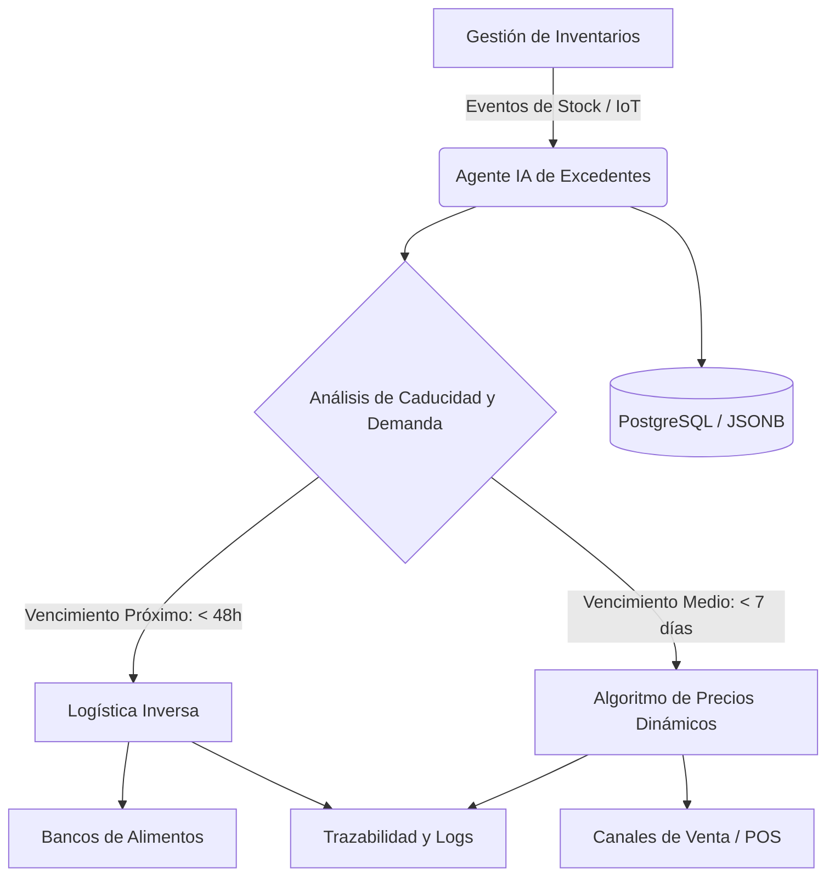

## 📌 Resumen Conciso
Un agente de Inteligencia Artificial para la gestión de perecederos es un sistema autónomo o semiautónomo diseñado para monitorear en tiempo real la vida útil, condiciones organolépticas y niveles de stock de productos alimenticios. Su propósito fundamental es automatizar decisiones críticas antes del vencimiento del producto, ejecutando estrategias como la aplicación de descuentos dinámicos, la redistribución hacia puntos de mayor demanda o la canalización automatizada mediante logística inversa hacia donaciones.

## 🗺️ Arquitectura


## 🛠️ Script / Implementación Mínima
Ejemplo de un micro-agente en Python que evalúa un lote de alimento perecedero y determina la acción óptima (descuento vs. donación) registrando el evento:

```python
from datetime import datetime, timedelta

class AgentePerecederos:
    def __init__(self, dias_criticos_donacion=2, dias_alerta_descuento=7):
        self.dias_criticos_donacion = dias_criticos_donacion
        self.dias_alerta_descuento = dias_alerta_descuento

    def evaluar_lote(self, producto: str, dias_para_vencer: int, stock: int) -> dict:
        if dias_para_vencer <= self.dias_criticos_donacion:
            accion = "REDIRECCIONAR_BANCO_ALIMENTOS"
            prioridad = "ALTA"
        elif dias_para_vencer <= self.dias_alerta_descuento:
            accion = "APLICAR_DESCUENTO_DINAMICO"
            prioridad = "MEDIA"
        else:
            accion = "MANTENER_STOCK_REGULAR"
            prioridad = "BAJA"

        return {
            "producto": producto,
            "dias_restantes": dias_para_vencer,
            "stock_afectado": stock,
            "accion_recomendada": accion,
            "prioridad": prioridad,
            "timestamp": datetime.now().isoformat()
        }

# Ejemplo de uso:
agente = AgentePerecederos()
evaluacion = agente.evaluar_lote(producto="Lácteos Lote #402", dias_para_vencer=1, stock=150)
print(f"Decisión del Agente: {evaluacion['accion_recomendada']} (Prioridad: {evaluacion['prioridad']})")
```

## 🔗 Conceptos Clave
- [[AI]]
- [[Bancos de Alimentos]]
- [[Gestión de Inventarios]]
- [[Gestión y Logística Inversa de Excedentes Alimentarios]]
- [[Logística Inversa]]
- [[Trazabilidad y Logs]]