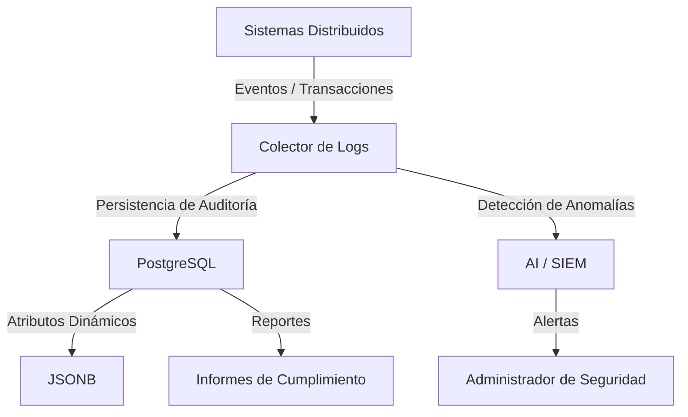

## 📌 Resumen Conciso
La **Auditoría de Sistemas** es el proceso sistemático para evaluar los controles, la infraestructura, los registros de actividad y las políticas de TI en una organización. Su propósito es garantizar la confidencialidad, integridad y disponibilidad de la información, asegurar el cumplimiento normativo (ISO 27001, SOC 2, GDPR) y permitir la trazabilidad completa de eventos para la detección de anomalías.

## 🗺️ Arquitectura


## 🛠️ Script / Implementación Mínima
Ejemplo de implementación de una tabla de auditoría con *triggers* utilizando **PostgreSQL** para registrar cambios en formato **JSONB**:

```sql
-- 1. Crear tabla para almacenar el log de auditoría
CREATE TABLE audit_log (
    id SERIAL PRIMARY KEY,
    tabla_afectada VARCHAR(50) NOT NULL,
    operacion VARCHAR(10) NOT NULL,
    usuario VARCHAR(50) DEFAULT CURRENT_USER,
    fecha TIMESTAMP DEFAULT CURRENT_TIMESTAMP,
    datos_anteriores JSONB,
    datos_nuevos JSONB
);

-- 2. Función genérica de auditoría
CREATE OR REPLACE FUNCTION fn_audit_trigger()
RETURNS TRIGGER AS $$
BEGIN
    IF (TG_OP = 'DELETE') THEN
        INSERT INTO audit_log(tabla_afectada, operacion, datos_anteriores)
        VALUES (TG_TABLE_NAME, TG_OP, to_jsonb(OLD));
        RETURN OLD;
    ELSIF (TG_OP = 'UPDATE') THEN
        INSERT INTO audit_log(tabla_afectada, operacion, datos_anteriores, datos_nuevos)
        VALUES (TG_TABLE_NAME, TG_OP, to_jsonb(OLD), to_jsonb(NEW));
        RETURN NEW;
    ELSIF (TG_OP = 'INSERT') THEN
        INSERT INTO audit_log(tabla_afectada, operacion, datos_nuevos)
        VALUES (TG_TABLE_NAME, TG_OP, to_jsonb(NEW));
        RETURN NEW;
    END IF;
    RETURN NULL;
END;
$$ LANGUAGE plpgsql;

-- 3. Asignación del trigger a una tabla objetivo
-- CREATE TRIGGER audit_usuarios_trigger
-- AFTER INSERT OR UPDATE OR DELETE ON usuarios
-- FOR EACH ROW EXECUTE FUNCTION fn_audit_trigger();
```

## 🔗 Conceptos Clave
- [[PostgreSQL]]
- [[JSONB]]
- [[Sistemas Distribuidos]]
- [[AI]]
- [[Trazabilidad y Logs]]
- [[Control de Accesos]]