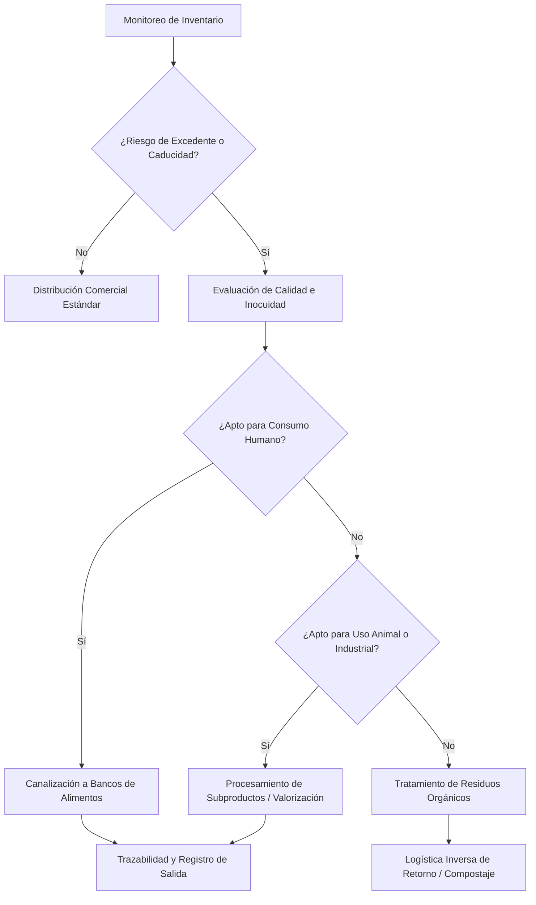

## 📌 Resumen Conciso
La gestión del desperdicio de alimentos en la industria alimentaria abarca el conjunto de estrategias operativas, tecnológicas y de distribución destinadas a prevenir, redistribuir y valorizar los excedentes de producción. Su propósito es optimizar la eficiencia de la cadena de suministro, garantizar la sostenibilidad operativa y canalizar los excedentes aptos para el consumo humano hacia redes de asistencia social antes de que se conviertan en residuos.

## 🗺️ Arquitectura


## 🛠️ Script / Implementación Mínima
```python
# Algoritmo de enrutamiento para gestión de excedentes alimentarios

def enrutar_excedente_alimentario(lote):
    """
    Determina el canal óptimo para el manejo de inventario alimentario
    según días restantes de vida útil y estado de inocuidad.
    """
    dias_caducidad = lote.get("dias_para_caducar")
    inocuo = lote.get("estado_inocuidad", False)
    
    if dias_caducidad > 15:
        return {"accion": "RE_ASIGNAR_VENTA", "destino": "Canal Comercial"}
    elif 3 <= dias_caducidad <= 15 and inocuo:
        return {"accion": "DONAR", "destino": "Bancos de Alimentos"}
    elif dias_caducidad < 3 and inocuo:
        return {"accion": "REPROCESAR", "destino": "Producción de Subproductos"}
    else:
        return {"accion": "RETIRO", "destino": "Logística Inversa / Valorización Orgánica"}

# Ejemplo de uso
lote_ejemplo = {"id_lote": "L-8842", "dias_para_caducar": 6, "estado_inocuidad": True}
resultado = enrutar_excedente_alimentario(lote_ejemplo)
# Output: {'accion': 'DONAR', 'destino': 'Bancos de Alimentos'}
```

## 🔗 Conceptos Clave
- [[Gestión y Logística Inversa de Excedentes Alimentarios]]
- [[Gestión de Inventarios]]
- [[Bancos de Alimentos]]
- [[Logística Inversa]]
- [[Trazabilidad y Logs]]