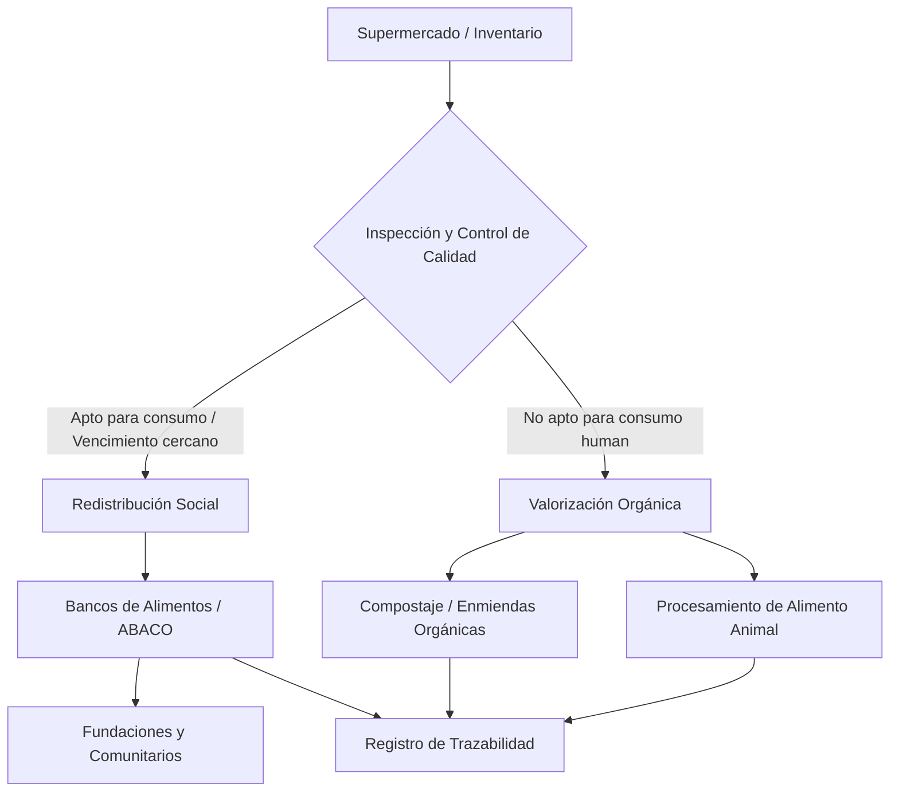

## 📌 Resumen Conciso
Proceso operacional y sistémico de recuperación, clasificación y redistribución de alimentos aptos y no aptos para el consumo que no fueron vendidos en la cadena retail de Colombia. Busca minimizar la merma mediante la canalización hacia la red de bancos de alimentos (como ABACO) o la transformación en subproductos (compostaje y alimento animal), asegurando el control sobre el ciclo de vida del producto.

## 🗺️ Arquitectura


## 🛠️ Script / Implementación Mínima
Script funcional en Python para la automatización de la regla de negocio al clasificar lotes de alimentos según su estado y fecha de caducidad:

```python
from datetime import datetime, timedelta

def clasificar_excedente(lote_id, fecha_vencimiento, estado_empaque):
    dias_restantes = (fecha_vencimiento - datetime.now()).days
    
    # Reglas de enrutamiento del producto
    if estado_empaque == "BUENO" and 1 <= dias_restantes <= 5:
        destino = "BANCO_DE_ALIMENTOS"
    elif estado_empaque == "BUENO" and dias_restantes > 5:
        destino = "REBAJA_EN_TIENDA"
    else:
        destino = "COMPOSTAJE_ALIMENTO_ANIMAL"
        
    return {
        "lote_id": lote_id,
        "timestamp": datetime.now().isoformat(),
        "destino_asignado": destino,
        "dias_para_vencer": dias_restantes
    }

# Ejemplo de uso
lote = clasificar_excedente("LOTE-8842", datetime.now() + timedelta(days=2), "BUENO")
print(f"Resultado de Clasificación: {lote}")
```

## 🔗 Conceptos Clave
- [[Trazabilidad y Logs]]
- [[Logística Inversa]]
- [[Sistemas Distribuidos]]
- [[Gestión de Inventarios]]
- [[Bancos de Alimentos]]