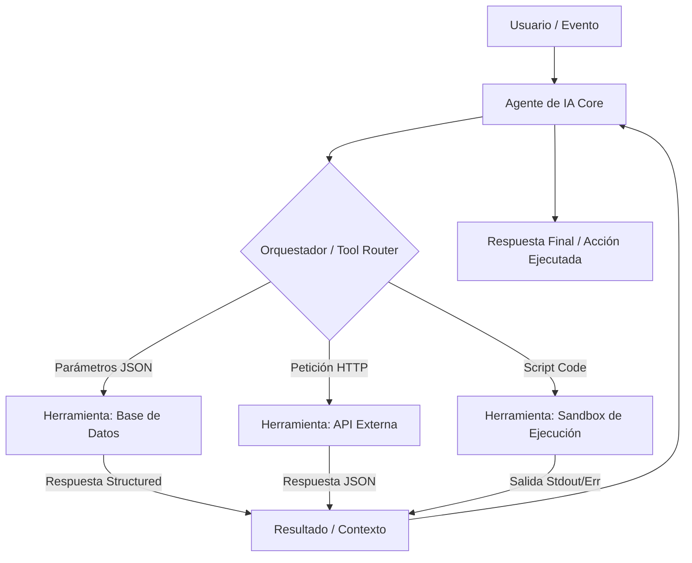

## 📌 Resumen Conciso
Las **herramientas para agentes** (*Tools for Agents*) son interfaces, funciones y conectores ejecutables que amplían las capacidades de un modelo de lenguaje o agente autónomo más allá de la generación de texto. Permiten al agente interactuar con el mundo exterior mediante el consumo de APIs, lectura/escritura en bases de datos, ejecución de código en entornos aislados y manipulación de sistemas de archivos, transformando las capacidades cognitivas del modelo en acciones concretas y deterministas.

## 🗺️ Arquitectura


## 🛠️ Script / Implementación Mínima
Ejemplo de definición e integración de una herramienta personalizada para un agente utilizando Python (estilo OpenAI Function Calling / LangChain):

```python
import json
from typing import Dict, Any

# 1. Definición del Esquema de la Herramienta (Tool Schema)
get_inventory_tool = {
    "name": "consultar_inventario",
    "description": "Consulta el stock disponible de un producto específico en la base de datos.",
    "parameters": {
        "type": "object",
        "properties": {
            "producto_id": {
                "type": "string",
                "description": "El identificador único del producto."
            }
        },
        "required": ["producto_id"]
    }
}

# 2. Implementación de la Función de la Herramienta
def consultar_inventario(producto_id: str) -> str:
    # Simulación de consulta a base de datos PostgreSQL/JSONB
    database_mock = {
        "PROD-001": {"nombre": "Manzanas", "stock": 150, "unidad": "kg"},
        "PROD-002": {"nombre": "Leche", "stock": 40, "unidad": "litros"}
    }
    
    res = database_mock.get(producto_id, None)
    if res:
        return json.dumps({"status": "success", "data": res})
    return json.dumps({"status": "error", "message": "Producto no encontrado"})

# 3. Router para ejecutar la herramienta según la decisión del Agente
def execute_agent_tool(tool_name: str, arguments: Dict[str, Any]) -> str:
    tools_registry = {
        "consultar_inventario": consultar_inventario
    }
    
    if tool_name in tools_registry:
        return tools_registry[tool_name](**arguments)
    raise ValueError(f"Herramienta '{tool_name}' no registrada.")

# Ejemplo de uso por el Agente:
# args = json.loads('{"producto_id": "PROD-001"}')
# print(execute_agent_tool("consultar_inventario", args))
```

## 🔗 Conceptos Clave
- [[AI]]
- [[Function Calling]]
- [[Sistemas Distribuidos]]
- [[JSONB]]
- [[Trazabilidad y Logs]]
- [[Agente Inteligente para la Optimización y Rescate de Alimentos Perecederos]]