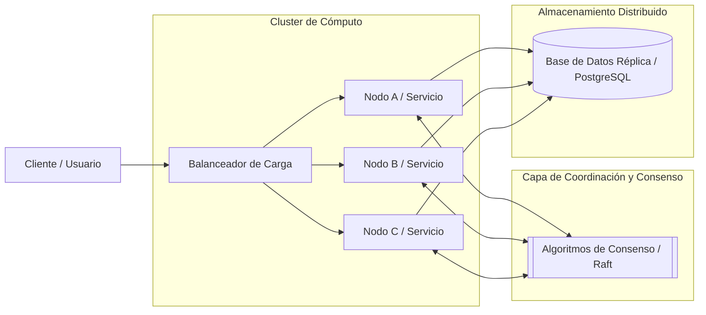

# Sistemas Distribuidos

Un **sistema distribuido** es una colección de computadoras independientes conectadas a través de una red que se comunican y coordinan sus acciones mediante el intercambio de mensajes, apareciendo ante el usuario final como un único sistema coherente.

## Caso de Uso Principal
Se emplean para construir plataformas de alta disponibilidad, gran capacidad de procesamiento y escalabilidad horizontal, tales como plataformas de *streaming*, procesamiento masivo de datos, microservicios, y bases de datos distribuidas o réplicas sincronizadas como [[PostgreSQL]].

---

## Arquitectura de un Sistema Distribuido



---

## Demostración Funcional en Python

El siguiente script simula un **Coordinador Distribuido** que asigna tareas a un conjunto de nodos (*workers*) con detección de fallos y reintentos (resiliencia y [[Tolerancia a Fallos]]):

```python
import concurrent.futures
import random
import time

class WorkerNode:
    """Simula un nodo de cómputo remoto en la red."""
    def __init__(self, node_id: str, failure_rate: float = 0.25):
        self.node_id = node_id
        self.failure_rate = failure_rate

    def execute_task(self, task_id: int) -> dict:
        # Simula latencia de red
        time.sleep(random.uniform(0.1, 0.3))
        # Simula un fallo aleatorio de red o nodo
        if random.random() < self.failure_rate:
            raise ConnectionError(f"Fallo de comunicación con {self.node_id}")
        return {"node": self.node_id, "task_id": task_id, "status": "COMPLETED"}

class DistributedCoordinator:
    """Coordinador con política de reintentos y balanceo aleatorio."""
    def __init__(self, workers: list[WorkerNode]):
        self.workers = workers

    def dispatch(self, task_id: int, max_retries: int = 3) -> dict:
        for attempt in range(1, max_retries + 1):
            worker = random.choice(self.workers)
            try:
                result = worker.execute_task(task_id)
                print(f"[ÉXITO] Tarea {task_id} procesada por {worker.node_id} (Intento {attempt})")
                return result
            except ConnectionError as err:
                print(f"[REINTENTO {attempt}/{max_retries}] {err} al procesar tarea {task_id}")
        
        return {"task_id": task_id, "status": "FAILED"}

if __name__ == "__main__":
    # Creación del clúster de 3 nodos
    cluster = [WorkerNode(f"Nodo-0{i}") for i in range(1, 4)]
    coordinator = DistributedCoordinator(cluster)

    # Procesamiento concurrente de tareas distribuidas
    tasks = [101, 102, 103, 104, 105]
    print("--- Iniciando Ejecución Distribuida ---")
    with concurrent.futures.ThreadPoolExecutor(max_workers=3) as executor:
        results = list(executor.map(coordinator.dispatch, tasks))

    print("\n--- Resultado Final del Clúster ---")
    for res in results:
        print(res)
```

---

## Conceptos Clave Interconectados

- [[Teorema CAP]]: Establece que un sistema distribuido solo puede garantizar simultáneamente dos de tres propiedades: Consistencia, Disponibilidad y Tolerancia al Particionado.
- [[Tolerancia a Fallos]]: Capacidad de un sistema de seguir funcionando correctamente ante el fallo de uno o más componentes.
- [[gRPC]]: Protocolo de comunicación de alto rendimiento para llamadas a procedimientos remotos (RPC).
- [[Balanceo de Carga]]: Mecanismo para redistribuir el tráfico de red o las tareas entre múltiples servidores.
- [[PostgreSQL]]: Sistema de gestión de bases de datos relacionales con soporte para replicación y alta disponibilidad.
