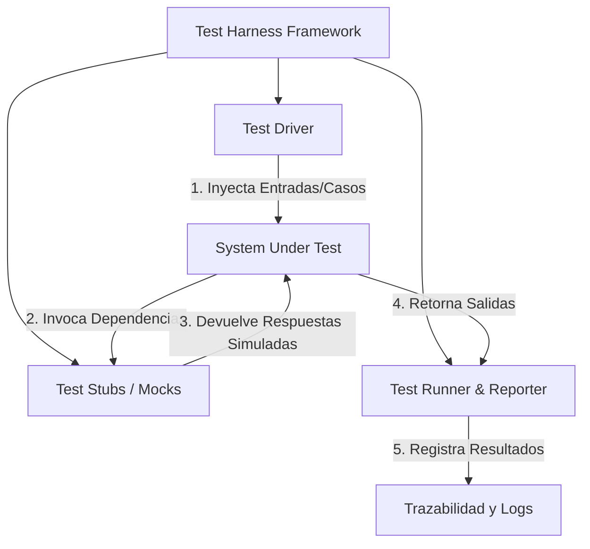

## 📌 Resumen Conciso
Un **Test Harness** (o Arnés de Pruebas) es un marco de trabajo compuesto por software, controladores (*drivers*), simuladores (*stubs/mocks*) y conjuntos de datos diseñados para automatizar la ejecución, monitoreo y evaluación de pruebas sobre un componente o sistema objetivo. Su propósito principal es aislar el elemento bajo prueba (*System Under Test - SUT*), simular entornos complejos y recopilar métricas precisas de ejecución sin requerir interacción manual.

## 🗺️ Arquitectura


## 🛠️ Script / Implementación Mínima
Ejemplo de un arnés de pruebas mínimo en Python para aislar y validar una función crítica de procesamiento:

```python
import time
from typing import Callable, Any, Dict

class TestHarness:
    """Arnés ligero para ejecutar y auditar pruebas unitarias/integración."""
    def __init__(self, target_component: Callable[[Any], Any]):
        self.sut = target_component
        self.results: list[Dict[str, Any]] = []

    def execute_case(self, case_id: str, payload: Any, expected: Any) -> Dict[str, Any]:
        start_time = time.perf_counter()
        try:
            actual = self.sut(payload)
            passed = (actual == expected)
            status = "PASSED" if passed else "FAILED"
        except Exception as err:
            actual = f"Exception: {type(err).__name__} - {str(err)}"
            status = "ERROR"
        
        duration_ms = round((time.perf_counter() - start_time) * 1000, 3)
        
        report = {
            "case_id": case_id,
            "status": status,
            "expected": expected,
            "actual": actual,
            "latency_ms": duration_ms
        }
        self.results.append(report)
        return report

# Ejemplo de uso:
if __name__ == "__main__":
    # Función a probar (SUT)
    def parse_sensor_data(data: dict) -> str:
        if "temp" not in data:
            raise KeyError("Métrica faltante")
        return "CRITICAL" if data["temp"] > 40 else "NORMAL"

    # Inicialización del Harness
    harness = TestHarness(parse_sensor_data)
    
    # Ejecución de casos
    print(harness.execute_case("TC-01", {"temp": 25}, "NORMAL"))
    print(harness.execute_case("TC-02", {"temp": 45}, "CRITICAL"))
    print(harness.execute_case("TC-03", {}, "ERROR"))
```

## 🔗 Conceptos Clave
- [[Pruebas Automatizadas]]
- [[Trazabilidad y Logs]]
- [[Sistemas Distribuidos]]
- [[Mocks y Stubs]]
- [[Integración Continua]]